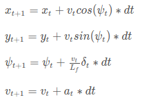
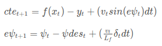

# CarND-Controls-MPC
Self-Driving Car Engineer Nanodegree Program

---

# Compilation

```bash
mkdir build && cd build
cmake .. && make
./mpc
```

# Implementaion

__The model__:
* a [6-element state vector](https://github.com/bo-rc/CarND-MPC-Project/blob/master/src/MPC.cpp#L124) is used to represent the kinematic model.
 * The elements are: `x, y, psi(heading angle), v, cte(cross track error), epsi(error of psi)`.
* the motion model is as the following:



* `cte` and `epsi` are updated according to: 



__Time step and Horizon time__:
* I finally chose `N = 10, dt = 0.1`, i.e. predict 10 steps ahead and using 100ms as the timestep.
 * I've tested `N = 10, 20, dt = 0.05, 0.1`. Due to the assumption that the system delay is 100ms, using `dt = 0.1` is most convenient to model the latency. Computing 20 steps ahead of time does not make much difference in terms of performance, so the final choice is `N = 10, dt = 0.1`.
 
__Polynomial Fitting and MPC processing__:
* a 2nd-order polynomial is used for trajectory fitting.
 * since the time horizon is 1 second, which is shorter than the time finishing a full turn on the test track. So, a 2nd-order polynomial is good enough to represent the predicted trajectory.
* waypoints are transformed from map frame to vehicle frame so that the error calculation becomes easier.

__Model Predictive Control with Latency__:
* a 100ms delay is used in the communication thread to model latency. Correspondingly, the control input is [delayed](https://github.com/bo-rc/CarND-MPC-Project/blob/master/src/MPC.cpp#L117) by 1 timestep, i.e. 100ms, to compensate the latency. Tests shows good result.

# Simulation full-lap running recording

[YouTube](https://youtu.be/cYjQrQfE9Ag)


